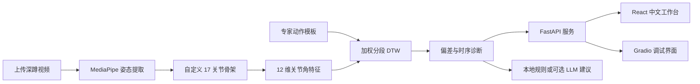

# MoveScope：可解释的单目深蹲动作质量评估

[](https://github.com/kxmzyc/movescope/actions/workflows/ci.yml)
[](https://www.python.org/)
[](CHANGELOG.md)
[](LICENSE)

MoveScope 是一个可解释的单目深蹲动作质量评估原型。系统将 MediaPipe 姿态结果映射为自定义 17 关节骨架，提取 12 维关节角特征，通过加权分段动态时间规整（DTW）将待测动作与专家模板对齐，最终返回评分、异常关节、峰值时刻和训练建议。

项目提供 FastAPI 服务、React/Vite 中文工作台、Gradio 调试界面、命令行工具，以及不依赖本地视频和模板的确定性合成演示。合成演示只用于验证真实的模板、对齐和评分链路，不代表真实视频精度。


## 已实现能力

- 使用 MediaPipe 提取人体姿态，并将 33 个关键点映射为自定义 17 关节骨架。
- 提取 12 维可解释关节角特征，并拒绝退化骨架和非有限值。
- 从专家视频或预计算特征构建动作模板，低方差场景使用可配置的 5 度容差下限。
- 实现标准 DTW 与方差反比加权的分段 DTW；分段不一致时自动回退到完整序列对齐。
- 输出总分、逐关节偏差、异常帧占比、峰值偏差与峰值时刻。
- 提供健康检查、模板发现、合成验证和视频评估 API。
- React 工作台支持视频校验、合成演示、诊断展示与 JSON 报告导出。
- 默认生成本地规则建议，也可选择接入 OpenAI 建议服务。
- 配置 Python 测试、前端构建和 GitHub Actions 持续集成。

## 系统流程



当待测序列与参考序列独立检测出的阶段数量不一致时，系统会回退到全序列加权 DTW，确保对齐路径完整覆盖动作起点和终点。

## 快速开始：合成验证

此流程不需要本地视频或动作模板，可直接验证 API、界面、DTW、评分和报告导出链路。

### 1. 安装 Python 依赖

请使用 Python 3.10 或 3.11。项目使用的 MediaPipe 0.10.x 不支持 Python 3.13。

```powershell
python -m venv .venv
.\.venv\Scripts\Activate.ps1
python -m pip install --upgrade pip
pip install -r requirements.txt
```

macOS/Linux：

```bash
python3.11 -m venv .venv
source .venv/bin/activate
python -m pip install --upgrade pip
pip install -r requirements.txt
```

### 2. 启动 API

```bash
python -m uvicorn api.main:app --host 127.0.0.1 --port 8000 --reload
```

检查服务：

```bash
curl http://127.0.0.1:8000/health
curl http://127.0.0.1:8000/demo
```

交互式 API 文档地址为 `http://127.0.0.1:8000/docs`。

### 3. 启动 Web 工作台

```bash
cd frontend/web
npm ci
npm run dev
```

打开 `http://127.0.0.1:5173`，等待界面显示 `API v0.2.1 已连接`，然后点击“运行合成演示”。响应元数据和界面都会明确标记该结果为合成验证。

## 真实视频评估流程

MoveScope 不附带第三方训练视频或预训练专家模板。请只使用你拥有或已获得授权处理的视频。

### 1. 准备专家视频

```text
data/
  expert/
    squat/
      expert_01.mp4
      expert_02.mp4
```

整个 `data/` 目录默认不会提交到 Git。

### 2. 构建专家动作模板

```bash
python scripts/build_template.py \
  --action squat \
  --expert-dir data/expert/squat
```

默认输出为 `data/templates/squat.npz`。重启 API 后，`GET /actions` 应返回 `{"actions":["squat"]}`。

也可以直接使用预计算的 `(T, 12)` 特征数组构建模板：

```bash
python scripts/build_template.py \
  --action squat \
  --features-dir data/features/expert_squat
```

### 3. 评估视频

可以使用 React 或 Gradio 界面，也可以直接调用 API：

```bash
curl -X POST http://127.0.0.1:8000/assess \
  -F "action=squat" \
  -F "video=@data/test/squat.mp4"
```

默认上传上限为 100 MB，支持 MP4、MOV、AVI、WEBM 和 MKV 格式。

## API 接口

| 方法 | 路径 | 用途 |
| --- | --- | --- |
| `GET` | `/health` | 获取服务状态与版本 |
| `GET` | `/actions` | 获取可用的本地动作模板 |
| `GET` | `/demo` | 运行确定性合成评估 |
| `POST` | `/assess` | 使用动作模板评估上传的视频 |

`POST /assess` 会拒绝不安全的动作名、不支持的扩展名、空文件、超过限制的上传、姿态检测覆盖率过低的视频，以及含非有限值的特征数据。

## 配置项

| 环境变量 | 是否必需 | 默认值 | 用途 |
| --- | --- | --- | --- |
| `MOVESCOPE_MAX_UPLOAD_MB` | 否 | `100` | 视频上传大小上限 |
| `MOVESCOPE_CORS_ORIGINS` | 否 | 本地 Vite 地址 | 允许访问 API 的 Web 来源，多个地址用逗号分隔 |
| `OPENAI_API_KEY` | 否 | 未设置 | 启用可选的远程训练建议 |
| `VITE_MOVESCOPE_API` | 否 | `http://127.0.0.1:8000` | 前端连接的 API 基础地址 |

安装可选的 OpenAI 依赖：

```bash
pip install -r requirements-llm.txt
```

未配置密钥或远程服务失败时，MoveScope 会自动返回确定性的本地训练建议。

## 开发与验证

```bash
pip install -r requirements-dev.txt
python -m pytest tests -q

cd frontend/web
npm ci
npm run build
npm run lint
```

当前 v0.2.1 的验证范围：

- 40 项 Python 单元、CLI、API、输入校验和回归测试。
- 覆盖 FastAPI 成功与错误路径、CORS、合成演示和上传限制。
- 覆盖 React TypeScript 生产构建与 oxlint 检查。
- 测试使用合成数组和模拟对象；仓库不包含公开的真实视频基准结果。

## 项目结构

```text
movescope/          姿态、特征、模板、DTW、评分和合成演示核心代码
api/                FastAPI 服务
frontend/web/       React/Vite 中文评估工作台
frontend/           Gradio 调试界面
scripts/            环境检查、模板构建、特征提取和数据辅助工具
tests/              Python 回归测试与 API 测试
notebooks/          实验脚手架，不包含已发表的结果结论
docs/               配置说明与项目文档
```

## 已知限制

- 17 关节表示为项目自定义结构：15 个关节直接映射自 MediaPipe，骨盆与颈部由双侧关键点中点计算，不是标准 COCO-17 布局。
- 默认流程使用 MediaPipe world landmarks 作为伪三维坐标，并非经过标定的生物力学三维重建。
- MotionBERT 推理适配器尚未实现；仅放置检查点不能启用该路径。
- 加权分段 DTW 仍是原型。在没有公开数据集和实验结果前，不声明准确率、临床有效性、视角鲁棒性或方法优越性。
- 实验 notebook 是可复现脚手架；本地缺少数据时会明确提示所需输入，不会生成虚构结果。
- MoveScope 只用于动作训练反馈与软件研究，不能替代专业教练或医疗意见。

## 数据与安全

- `data/`、`.env*`、本地模型、缓存、生成视频和前端构建产物均不会提交到 Git。
- 不要提交私人训练视频、API 密钥或可识别个人身份的健康信息。
- 视频搜索脚本只用于候选内容发现。请遵守平台条款，并仅下载和处理已获授权的内容。

## 引用方式

GitHub 可读取 [CITATION.cff](CITATION.cff)，[CITATION.md](CITATION.md) 中也提供了 BibTeX 软件引用格式。

## 开源许可

MoveScope 使用 [Apache License 2.0](LICENSE) 开源许可。
