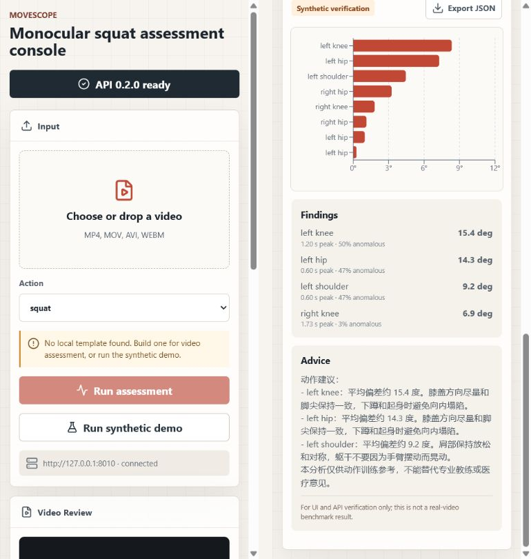
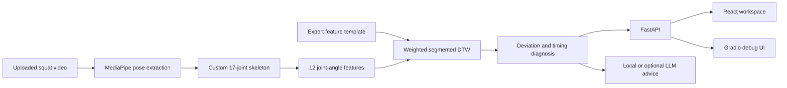

# MoveScope

[](https://github.com/kxmzyc/movescope/actions/workflows/ci.yml)
[](https://www.python.org/)
[](CHANGELOG.md)
[](LICENSE)

MoveScope is an interpretable monocular squat-assessment prototype. It maps MediaPipe pose output to a custom 17-joint skeleton, derives 12 joint-angle features, aligns a test sequence with an expert template using weighted segmented DTW, and returns structured timing and deviation feedback.

The repository includes a FastAPI service, a React/Vite workspace, a Gradio debug UI, CLI tools, and a deterministic synthetic demo that exercises the real template, alignment, and scoring code without claiming real-video accuracy.



## What Works

- MediaPipe pose extraction and mapping from 33 landmarks to a custom 17-joint skeleton.
- Twelve interpretable angle features with invalid-skeleton detection.
- Expert-template construction with a configurable 5-degree tolerance floor.
- Standard DTW and variance-weighted segmented DTW with complete-path fallback.
- Total score, per-feature deviation, anomaly ratio, peak deviation, and peak time.
- FastAPI endpoints for health, templates, synthetic verification, and video assessment.
- React/Vite interface with template discovery, video validation, synthetic demo, diagnostics, and JSON export.
- Local fallback coaching plus an optional OpenAI advice path.
- Python tests and frontend checks in GitHub Actions.

## System Flow



The segmented aligner falls back to full-sequence weighted DTW whenever independently detected segment counts do not match. This preserves complete start-to-end alignment rather than dropping frames.

## Quick Start: Synthetic Verification

This path requires no local videos or templates. It is intended to verify the API, UI, DTW, scoring, and report-export flow.

### 1. Install Python dependencies

Use Python 3.10 or 3.11. MediaPipe 0.10.x is not supported by the project on Python 3.13.

```powershell
python -m venv .venv
.\.venv\Scripts\Activate.ps1
python -m pip install --upgrade pip
pip install -r requirements.txt
```

macOS/Linux activation:

```bash
python3.11 -m venv .venv
source .venv/bin/activate
python -m pip install --upgrade pip
pip install -r requirements.txt
```

### 2. Start the API

```bash
python -m uvicorn api.main:app --host 127.0.0.1 --port 8000 --reload
```

Verify it:

```bash
curl http://127.0.0.1:8000/health
curl http://127.0.0.1:8000/demo
```

Interactive API documentation is available at `http://127.0.0.1:8000/docs`.

### 3. Start the web workspace

```bash
cd frontend/web
npm ci
npm run dev
```

Open `http://127.0.0.1:5173`, wait for `API 0.2.0 ready`, and select **Run synthetic demo**. Results are marked as synthetic in both the response metadata and the UI.

## Real-Video Workflow

MoveScope does not ship third-party exercise footage or a pretrained expert template. Use only videos you own or are authorized to process.

### 1. Prepare expert videos

```text
data/
  expert/
    squat/
      expert_01.mp4
      expert_02.mp4
```

The entire `data/` directory is git-ignored.

### 2. Build the expert template

```bash
python scripts/build_template.py \
  --action squat \
  --expert-dir data/expert/squat
```

Expected output: `data/templates/squat.npz`. After the API restarts, `GET /actions` should return `{"actions":["squat"]}`.

Templates can also be built from precomputed `(T, 12)` feature arrays:

```bash
python scripts/build_template.py \
  --action squat \
  --features-dir data/features/expert_squat
```

### 3. Assess a video

Use the React or Gradio UI, or call the API directly:

```bash
curl -X POST http://127.0.0.1:8000/assess \
  -F "action=squat" \
  -F "video=@data/test/squat.mp4"
```

The default upload limit is 100 MB. Supported extensions are MP4, MOV, AVI, WEBM, and MKV.

## API

| Method | Path | Purpose |
| --- | --- | --- |
| `GET` | `/health` | Service status and version |
| `GET` | `/actions` | Available local templates |
| `GET` | `/demo` | Deterministic synthetic assessment |
| `POST` | `/assess` | Assess an uploaded video against a template |

`POST /assess` rejects unsafe action names, unsupported extensions, empty files, uploads over the configured limit, low pose-detection coverage, and non-finite feature data.

## Configuration

| Variable | Required | Default | Purpose |
| --- | --- | --- | --- |
| `MOVESCOPE_MAX_UPLOAD_MB` | No | `100` | Maximum uploaded video size |
| `MOVESCOPE_CORS_ORIGINS` | No | Local Vite origins | Comma-separated allowed web origins |
| `OPENAI_API_KEY` | No | unset | Enables optional API-backed coaching advice |
| `VITE_MOVESCOPE_API` | No | `http://127.0.0.1:8000` | Frontend API base URL |

Install the optional OpenAI dependency with:

```bash
pip install -r requirements-llm.txt
```

Without an API key or if the provider fails, MoveScope returns deterministic local coaching text.

## Development and Verification

```bash
pip install -r requirements-dev.txt
python -m pytest tests -q

cd frontend/web
npm ci
npm run build
npm run lint
```

Current v0.2.0 verification scope:

- 40 Python unit, CLI, API, validation, and regression tests.
- FastAPI success/error paths, CORS, synthetic demo, and upload-limit checks.
- React TypeScript production build and oxlint.
- Synthetic arrays and mocks only; no public real-video benchmark is included.

## Project Structure

```text
movescope/          Core pose, features, templates, DTW, scoring, and demo
api/                FastAPI service
frontend/web/       React/Vite assessment workspace
frontend/           Gradio debug UI
scripts/            Environment, template, feature, and data helpers
tests/              Python regression and API tests
notebooks/          Experiment scaffolds; no published result claims
docs/               Setup and project documentation
```

## Known Limitations

- The 17-joint representation is project-specific: 15 joints map directly from MediaPipe, while pelvis and neck are bilateral midpoints. It is not the standard COCO-17 layout.
- The default pipeline uses MediaPipe world landmarks as pseudo-3D coordinates; they are not a calibrated biomechanical reconstruction.
- The MotionBERT inference adapter is not implemented. A checkpoint alone does not enable that path.
- Weighted segmented DTW is a prototype. No accuracy, clinical validity, viewpoint robustness, or superiority claim is made without a public dataset and experiment results.
- Experiment notebooks are reproducible scaffolds and intentionally report missing-data requirements when local data is absent.
- MoveScope is for training feedback and software research only. It is not medical advice.

## Data and Security

- `data/`, `.env*`, local models, caches, generated videos, and frontend build output are excluded from git.
- Do not commit private exercise videos, API keys, or identifiable health information.
- The video-search helper is provided for metadata discovery. Follow platform terms and use only content you are authorized to download and process.

## Citation

GitHub can read [CITATION.cff](CITATION.cff). A BibTeX software entry is also available in [CITATION.md](CITATION.md).

## License

MoveScope is released under the [Apache License 2.0](LICENSE).
