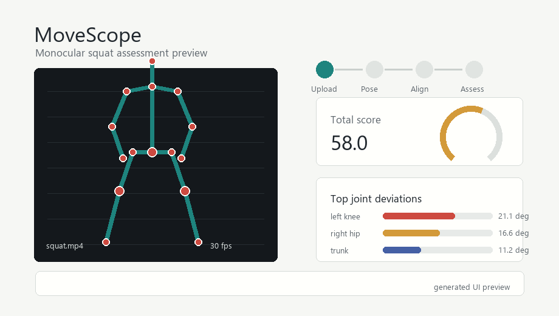

# MoveScope

[](.github/workflows/ci.yml)
[](LICENSE)

MoveScope is a monocular-video action quality assessment prototype for interpretable squat analysis.



The current v0.1.0 prototype extracts MediaPipe pose landmarks, converts them into interpretable joint-angle features, aligns test motion against an expert template with weighted segmented DTW, and returns structured correction feedback through CLI scripts, a FastAPI backend, a Gradio MVP, and a React/Vite demo frontend.

## Features

- Monocular pose extraction with MediaPipe 2D landmarks and pseudo-3D world landmarks.
- Twelve interpretable angle features focused on lower-body and posture deviations.
- Expert-template statistics with tolerance bands for action-specific scoring.
- Standard DTW and weighted segmented DTW alignment.
- Structured diagnosis with total score, per-joint deviation summaries, anomaly timing, and fallback coaching text.
- Optional OpenAI-backed advice path when `OPENAI_API_KEY` and the `openai` package are available.
- Reproducible experiment scaffolds for ablation, viewpoint robustness, and template sensitivity studies.
- Local Gradio app, FastAPI service, and React/Vite web demo.

## Architecture

```text
video
  -> PoseExtractor
  -> FeatureExtractor
  -> ActionTemplate
  -> WeightedSegmentedDTWAligner
  -> AssessmentEngine
  -> LLMAdvisor / API / UI
```

The current extractor uses MediaPipe world landmarks as pseudo-3D coordinates. Full MotionBERT-style 3D lifting is not required for the v0.1.0 pipeline and remains a future extension point.

## Installation

Use Python 3.10 or 3.11. The pinned MediaPipe dependency is not expected to work on Python 3.13.

Windows PowerShell:

```powershell
python -m venv .venv
.\.venv\Scripts\Activate.ps1
python -m pip install --upgrade pip
pip install -r requirements.txt
```

macOS/Linux:

```bash
python3.11 -m venv .venv
source .venv/bin/activate
python -m pip install --upgrade pip
pip install -r requirements.txt
```

Check the local environment:

```bash
python scripts/check_environment.py
```

## Quick Start

Search for candidate videos without downloading:

```bash
python scripts/fetch_videos.py --action squat --mode expert --n 3 --lang zh --dry-run
```

Download videos into experiment folders:

```bash
python scripts/fetch_videos.py --action squat --mode test --n 20 --lang both --output-dir data/test/good_squat
python scripts/fetch_videos.py --action squat --mode test --n 20 --lang both --output-dir data/test/bad_squat
```

Run the pose extraction smoke test on a local squat video:

```bash
python scripts/hello_world.py --video path/to/squat.mp4
```

Build and assess from precomputed feature arrays:

```bash
python scripts/build_template.py --action squat --features-dir path/to/expert_features
python scripts/assess_features.py --action squat --features path/to/test_features.npy
```

Start the Gradio demo after a squat template exists:

```bash
python frontend/gradio_app.py
```

Open `http://localhost:7860`, upload a squat video, and inspect the skeleton overlay, score, joint-deviation chart, and correction advice.

Start the FastAPI backend:

```bash
python -m uvicorn api.main:app --port 8000 --reload
```

Useful endpoints:

- `GET /health`
- `GET /actions`
- `POST /assess` with multipart fields `video` and optional `action`

Start the React/Vite frontend:

```bash
cd frontend/web
npm install
npm run dev
```

The React app talks to `http://127.0.0.1:8000` by default. Set `VITE_MOVESCOPE_API` if the API is running elsewhere.

## Experiments

The notebooks are designed to execute safely without local data and print the missing-data requirements. Add local videos, templates, or precomputed feature arrays before running full experiments.

```bash
jupyter nbconvert --to notebook --execute notebooks/ablation_experiment.ipynb
jupyter nbconvert --to notebook --execute notebooks/viewpoint_robustness.ipynb
jupyter nbconvert --to notebook --execute notebooks/template_sensitivity.ipynb
```

For template sensitivity, place precomputed feature arrays under:

- `data/features/expert_squat/`
- `data/features/test_squat/`

## Development

Run the Python tests:

```bash
python -m pytest tests -q
```

Run the frontend checks:

```bash
cd frontend/web
npm run build
npm run lint
```

Continuous integration is configured in `.github/workflows/ci.yml`. After publishing the repository, replace the static CI badge with the repository-specific GitHub Actions status badge.

## Project Status

- Core feature, template, DTW alignment, and assessment modules have unit tests.
- Local advice fallback, Gradio MVP, FastAPI backend, and React/Vite frontend are implemented.
- Experiment notebooks are scaffolded for ablation, viewpoint robustness, and template sensitivity.
- Real-video assessment requires local data and a built expert template.
- Generated `docs/demo.gif` is a UI preview, not an evaluation result from a real uploaded video.

## Citation

If you use MoveScope in academic work, cite the placeholder entry in [CITATION.md](CITATION.md).

## License

MoveScope is released under the [Apache License 2.0](LICENSE).
