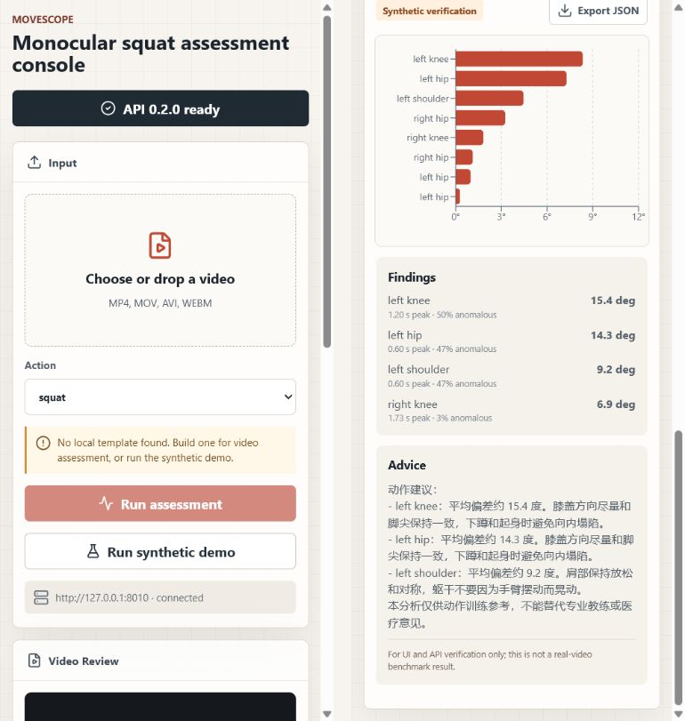
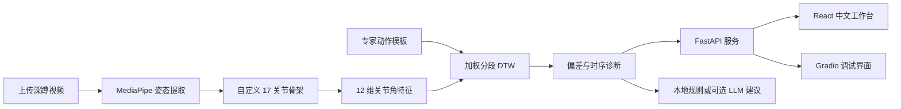

# MoveScope：可解释的单目深蹲动作质量评估

[](https://github.com/kxmzyc/movescope/actions/workflows/ci.yml)
[](https://www.python.org/)
[](CHANGELOG.md)
[](LICENSE)

MoveScope 是一个可解释的单目深蹲动作质量评估原型。系统将 MediaPipe 姿态结果映射为自定义 17 关节骨架，提取 12 维关节角特征，通过加权分段动态时间规整（DTW）将待测动作与专家模板对齐，最终返回评分、异常关节、峰值时刻和训练建议。

项目提供 FastAPI 服务、React/Vite 中文工作台、Gradio 调试界面、命令行工具，以及不依赖本地视频和模板的确定性合成演示。合成演示只用于验证真实的模板、对齐和评分链路，不代表真实视频精度。



## 已实现能力

- 使用 MediaPipe 提取人体姿态，并将 33 个关键点映射为自定义 17 关节骨架。
- 提取 12 维可解释关节角特征；非核心特征列数据不完整时自动降级评估并在响应中列出未参与评分的关节，双膝双髋缺失时给出点名关节的可读报错。
- 从专家视频或预计算特征构建动作模板，低方差场景使用可配置的 5 度容差下限；1/std 特征权重带极差钳制，小样本模板不会被单特征主导。
- 实现标准 DTW 与方差反比加权的分段 DTW；分段不一致时自动回退到完整序列对齐。
- 输出总分、逐关节偏差、异常帧占比、峰值偏差与峰值时刻；异常帧按唯一测试帧统计，动作停顿不会重复计分。
- 响应携带逐帧关节角时间轴（实测曲线、对齐专家曲线、容差、越界标记）、2D 骨架关键点通道、每个关节的容差与评分权重，评分依据可以从响应直接读出。
- 提供健康检查、模板发现（含模板元数据）、合成验证和视频评估 API，并带上传并发上限保护。
- React 工作台支持视频校验、合成演示、逐帧时间轴（专家容差走廊 + 点击跳转视频）、canvas 骨架叠加（按阶段高亮异常关节）、可点击阶段时间轴、偏差方向与姿态质量展示、JSON 报告导出。
- 默认生成本地规则建议；远程 OpenAI 建议需显式开启（`MOVESCOPE_ADVICE_PROVIDER=openai`），响应中标注建议实际来源。
- 配置 Python 测试、前端构建和 GitHub Actions 持续集成。

## 系统流程


```mermaid
flowchart LR
    A["上传深蹲视频"] --> B["MediaPipe 姿态提取"]
    B --> C["自定义 17 关节骨架"]
    C --> D["12 维关节角特征"]
    E["专家动作模板"] --> F["加权分段 DTW"]
    D --> F
    F --> G["偏差与时序诊断"]
    G --> H["FastAPI 服务"]
    H --> I["React 中文工作台"]
    H --> J["Gradio 调试界面"]
    G --> K["本地规则或可选 LLM 建议"]
```

当待测序列与参考序列独立检测出的阶段数量不一致时，系统会回退到全序列加权 DTW，确保对齐路径完整覆盖动作起点和终点。

## 快速开始：合成验证

此流程不需要本地视频或动作模板，可直接验证 API、界面、DTW、评分和报告导出链路。

### 1. 安装 Python 依赖

请使用 Python 3.10 或 3.11。项目使用的 MediaPipe 0.10.x 不支持 Python 3.13。

```powershell
python -m venv .venv
.\.venv\Scripts\Activate.ps1
python -m pip install --upgrade pip
pip install -e .
```

macOS/Linux：

```bash
python3.11 -m venv .venv
source .venv/bin/activate
python -m pip install --upgrade pip
pip install -e .
```

依赖版本固定在 `pyproject.toml` 中；`pip install -r requirements.txt` 仍然可用（等价于 `pip install -e .`）。可编辑安装同时会注册 `movescope-build-template`、`movescope-assess-features`、`movescope-extract-pose`、`movescope-check-env`、`movescope-fetch-videos` 等命令行工具。

### 2. 启动 API

```bash
python -m uvicorn api.main:app --host 127.0.0.1 --port 8000 --reload
```

检查服务：

```bash
curl http://127.0.0.1:8000/health
curl http://127.0.0.1:8000/demo
```

交互式 API 文档地址为 `http://127.0.0.1:8000/docs`。

### 3. 启动 Web 工作台

```bash
cd frontend/web
npm ci
npm run dev
```

打开 `http://127.0.0.1:5173`，等待界面显示 `API v0.4.0 已连接`，然后点击“运行合成演示”。响应元数据和界面都会明确标记该结果为合成验证。

## 真实视频评估流程

MoveScope 不附带第三方训练视频或预训练专家模板。请只使用你拥有或已获得授权处理的视频。

### 1. 准备专家视频

```text
data/
  expert/
    squat/
      expert_01.mp4
      expert_02.mp4
```

整个 `data/` 目录默认不会提交到 Git。

### 2. 构建专家动作模板

```bash
python scripts/build_template.py \
  --action squat \
  --expert-dir data/expert/squat
```

默认输出为 `data/templates/squat.npz`。重启 API 后，`GET /actions` 应返回动作名单与模板元数据：`{"actions":["squat"],"templates":[{"action":"squat","n_videos":2,"feature_dim":12,"frames":150}]}`（数值以实际模板为准）。

也可以直接使用预计算的 `(T, 12)` 特征数组构建模板：

```bash
python scripts/build_template.py \
  --action squat \
  --features-dir data/features/expert_squat
```

### 3. 评估视频

可以使用 React 或 Gradio 界面，也可以直接调用 API：

```bash
curl -X POST http://127.0.0.1:8000/assess \
  -F "action=squat" \
  -F "video=@data/test/squat.mp4"
```

默认上传上限为 100 MB，支持 MP4、MOV、AVI、WEBM 和 MKV 格式。

## API 接口

| 方法 | 路径 | 用途 |
| --- | --- | --- |
| `GET` | `/health` | 获取服务状态、版本、上传上限与支持的扩展名 |
| `GET` | `/actions` | 获取可用的本地动作模板与模板元数据 |
| `GET` | `/demo` | 运行确定性合成评估 |
| `POST` | `/assess` | 使用动作模板评估上传的视频 |

所有端点均带 Pydantic 响应模型，`http://127.0.0.1:8000/docs` 提供完整的字段类型。诊断响应中的每个异常项包含结构化关节标识（`joint`、`parent`、`child`、`joint_display`）与偏差方向，`phases` 为分段对齐真实检测到的多个阶段；分段失败回退到全序列对齐时，`segmented` 字段为 `false`。

诊断响应还包含：`timeline`（按测试帧对齐的逐帧关节角时间轴，含实测/专家曲线、容差与越界标记，超长视频自动降采样）、`skeleton`（降采样 2D 骨架关键点、置信度与连接表，仅视频评估返回）、`per_feature_summary` 中每个关节的 `tolerance_deg` 与 `score_weight`、`excluded_features`（未参与评分的特征及原因）与 `advice_source`（建议实际来源）。

`POST /assess` 会拒绝不安全的动作名、不支持的扩展名、空文件、超过限制的上传、无法解码的损坏视频、姿态检测覆盖率过低的视频，以及双膝双髋核心特征数据不完整的输入；并发占满时返回 503。

## 配置项

| 环境变量 | 是否必需 | 默认值 | 用途 |
| --- | --- | --- | --- |
| `MOVESCOPE_DATA_DIR` | 否 | `data` | 模板与数据根目录 |
| `MOVESCOPE_MAX_UPLOAD_MB` | 否 | `100` | 视频上传大小上限 |
| `MOVESCOPE_CORS_ORIGINS` | 否 | 本地 Vite 地址 | 允许访问 API 的 Web 来源，多个地址用逗号分隔 |
| `MOVESCOPE_CORS_ORIGIN_REGEX` | 否 | 本地地址正则 | 允许来源的正则表达式，部署到非 localhost 域名时配置 |
| `MOVESCOPE_ASSESS_TIMEOUT_SEC` | 否 | `300` | 单次视频评估的超时秒数 |
| `MOVESCOPE_MAX_CONCURRENT_ASSESS` | 否 | `2` | `/assess` 并发上限，占满返回 503 |
| `MOVESCOPE_ADVICE_PROVIDER` | 否 | `rule` | 训练建议来源：`rule` 本地规则 / `openai` 远程模型 / `off` 关闭 |
| `MOVESCOPE_OPENAI_MODEL` | 否 | `gpt-4o` | 远程建议使用的模型 |
| `MOVESCOPE_OPENAI_TIMEOUT_SEC` | 否 | `20` | 远程建议请求超时秒数 |
| `OPENAI_API_KEY` | 否 | 未设置 | 远程建议的密钥（还需将 `MOVESCOPE_ADVICE_PROVIDER` 设为 `openai`） |
| `VITE_MOVESCOPE_API` | 否 | `http://127.0.0.1:8000` | 前端连接的 API 基础地址 |

安装可选的 OpenAI 依赖：

```bash
pip install -r requirements-llm.txt
```

远程建议是显式开启项：只有 `MOVESCOPE_ADVICE_PROVIDER=openai` 且配置了密钥时，诊断数据才会发送给 OpenAI；未开启、未配置密钥或远程失败时，MoveScope 返回确定性的本地训练建议，响应中的 `advice_source` 字段标注实际来源。

## 开发与验证

```bash
pip install -e .[dev]
python -m ruff check .
python -m mypy movescope api
python -m pytest tests -q

cd frontend/web
npm ci
npm run build
npm run lint
npm run test
```

当前 v0.4.0 的验证范围：

- 88 项 Python 单元、CLI、API、输入校验和回归测试，其中 25 项为向量化 DTW 与旧逐单元实现的随机对拍（路径逐点一致），并含分段多阶段输出、逐帧时间轴、特征降级剔除与权重钳制的直接测试。
- ruff 静态检查与 mypy 类型检查覆盖 `movescope` 与 `api` 全部模块。
- 覆盖 FastAPI 成功与错误路径（损坏视频 400、超时 504、繁忙 503、空文件 400）、CORS、合成演示和上传限制；API 测试对开发者 shell 的 `MOVESCOPE_*` 环境变量免疫。
- 28 项 vitest 前端测试覆盖 API 客户端、上传校验 hook 与各面板组件（含时间轴面板、阶段时间轴与骨架叠加），另有 React TypeScript 生产构建与 oxlint 检查。
- 测试使用合成数组和模拟对象；仓库不包含公开的真实视频基准结果。

## 项目结构

```text
movescope/            核心包
  alignment/          向量化 DTW（dtw.py）、阶段分割（segmentation.py）与对齐器
  cli/                命令行工具实现（注册为 movescope-* 命令）
  assessment.py       评估引擎（assess_features / assess_coords / assess_pose）
  features.py         12 维关节角特征与结构化关节标识
  scoring.py          评分纯函数
  advice.py           本地规则与可选 OpenAI 训练建议
  reporting.py        文本摘要与 JSON 报告
  template.py         专家动作模板
  pose_extractor.py   MediaPipe 姿态提取
  config.py           环境变量集中配置
  types.py            PoseResult / Alignment 数据类型
api/                  FastAPI 服务（main/routes/schemas/services/settings/errors）
frontend/web/         React/Vite 中文工作台（api 客户端 + hooks + 组件 + vitest）
frontend/             Gradio 调试界面
scripts/              兼容旧调用方式的命令行转发壳
tests/                Python 回归测试、DTW 对拍测试与 API 测试
notebooks/            实验脚手架，不包含已发表的结果结论
docs/                 配置说明、设计文档与项目文档
```

## 已知限制

- 17 关节表示为项目自定义结构：15 个关节直接映射自 MediaPipe，骨盆与颈部由双侧关键点中点计算，不是标准 COCO-17 布局。
- 默认流程使用 MediaPipe world landmarks 作为伪三维坐标，并非经过标定的生物力学三维重建。
- MotionBERT 推理适配器尚未实现；仅放置检查点不能启用该路径。
- 加权分段 DTW 仍是原型。在没有公开数据集和实验结果前，不声明准确率、临床有效性、视角鲁棒性或方法优越性。
- 实验 notebook 是可复现脚手架；本地缺少数据时会明确提示所需输入，不会生成虚构结果。
- MoveScope 只用于动作训练反馈与软件研究，不能替代专业教练或医疗意见。

## 数据与安全

- `data/`、`.env*`、本地模型、缓存、生成视频和前端构建产物均不会提交到 Git。
- 不要提交私人训练视频、API 密钥或可识别个人身份的健康信息。
- 视频搜索脚本只用于候选内容发现。请遵守平台条款，并仅下载和处理已获授权的内容。

## 引用方式

GitHub 可读取 [CITATION.cff](CITATION.cff)，[CITATION.md](CITATION.md) 中也提供了 BibTeX 软件引用格式。

## 开源许可

MoveScope 使用 [Apache License 2.0](LICENSE) 开源许可。
